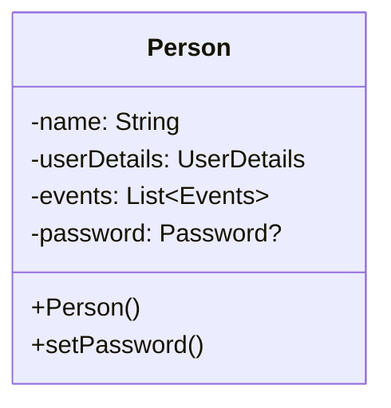

# Coding Events

## Overview
Coding events is a web application for tracking events submitted by a user built with the Spring Boot framework. It can be used to save and categorize events with a couple quantifiers also defined by the user.

## Current Status
Coding Events is still in development without a deployed production build. It can currently be run with a local MySQL database with a coding-events table, and running the source code via Gradle.
Requirements:
- Java 11
- MySQL 8.0.32

## Future features
- User profiles and authentication
    - Users will be integrated allowing users to track a list of events
    - Events will also be able to track attending users and display stats about participation.

- Calendar for event
    - Events will have dates
    - Events can be displayed on a calendar layout
    - Events can repeat at various intervals
    - Users can choose to subscribe to reoccurring events.